# 知识驱动的程序合成

[*>> Check this page in English*](/research/kdps/)

## 背景

*程序合成*（PS：Program Synthesis）旨在自动编写计算机程序以满足多种规范。在进化计算（EC：Evolutionary Computation）领域中，经常使用的规范是 I/O 示例。

EC 是一组优化方法。因此，PS 问题自然而然地被建模为该领域的优化问题。 **PS 旨在从可用指令的集合中找到一系列指令，以最小化实际输出与预期输出之间的差异。**

下面是一个 PS 问题的示例。

- 指令集：`in0`、`in1`、`add`、`sub`、`mult`、`div`

- I/O 示例
  - input=(0,0)；output=0
  - input=(1,0)；output=1
  - input=(0,2)；output=4
  - ……

- 程序：`mult(sub(in0,in1), sub(in0,in1))`

*遗传编程*（GP：Genetic Programming）是一组合成计算机程序的进化算法。它含有初始化、选择、交叉和变异等典型步骤。 GP 已被用于许多应用，例如进化神经网络、提取图像特征、提取交易规则、设计机器人和设计电路。

## 研究目的

在这个研究中，我们关注一个**改进自己的 GP 算法**。

人类程序员每天都在编写程序。如果我们在云端运行一个 GP 算法，并连续向这个 GP 提出程序合成问题，这个 GP 算法将像人类一样面临无穷无尽的不同问题。有趣的事情是，我们人类通过对这些问题的实践来提高自己。很自然地，我们想问 GP 能不能像人一样解决问题并提升自己？不幸的是，传统的 GP 无法做到这一点。多次重复运行 GP 来解决相同的问题，性能也不会提升。

当我们审视一个人如何提高自己时，我们会想到几个术语：“学习”、“知识”和“经验”。这些概念之间肯定存在联系。其中一个联系是，**知识是我们从经验中学到的东西**。具体到计算机编程，我们经常做的一件事就是复用过去编写的代码片段（子程序）。例如以下的两段代码。

```python
'''遗传算法
'''
for i in range(N): # 初始化
    x = np.random.uniform(xl, xu, nvar)
    X.append(x)
```

```python
'''人工蜂群
'''
if n >= n_limit: # 侦察蜂
    x = np.random.uniform(xl, xu, nvar)
    X.append(x)
```

第一个是 python 编写的遗传算法的初始化步骤，第二个是同种语言中人工蜂群的侦察蜂算子。这里重要的是这些代码的最后两行是相同的。因此，如果我们已经编写了遗传算法，我们可以简单地复制和粘贴代码来编写人工蜂群算法。

因此，在计算机程序设计中，子程序是一种知识，我们对这些知识所做的就是将其存储起来并适当地重复使用。

在本研究中，我们想对 GP 算法做类似的事情（子程序复用）。事实上，有一些研究致力于子程序复用。

1. 单个问题中的复用

   这部分研究主要包括模块化方法，例如自动定义函数（ADF：Automatically Defined Function）。

2. 跨多个相似问题的复用

   一些研究建议复用指令集、最终种群和最佳解中的指令。

在这里，我们直接提出我们的研究问题：**当问题很多，而且这些问题不一定相似时，GP 如何通过子程序（知识）复用来改进自己？**

我们称此问题为*知识驱动程序的程序合成*（KDPS：Knowledge-Driven Program Synthesis）问题。在 KDPS 问题中，GP 需要解决一系列 PS 问题。在解决问题时，GP 会复用过去问题的子程序。

值得注意的是，我们并未假设问题系列很小或系列中的问题相似。因此，像复用最终种群（使用 GP 的最终种群作为另一 GP 的初始种群）这样的简单方法可能效果不佳。

目前，我们将这个问题分为三个部分。我们在 SSCI 2022 上的一篇论文的最后两部分有了一些初步结果。

1. 给定一个程序，我们如何提取子程序？

2. 给定一个子程序，我们如何复用它？

3. 给定一组子程序，我们如何选择合适的子程序来使用？

有关更多详细信息，您可以查看下面的演示文稿。

## SSCI 2022 学术报告

请查看以下演示文稿以了解更多详细信息。该演示文稿在 IEEE SSCI 2022 会议上使用。


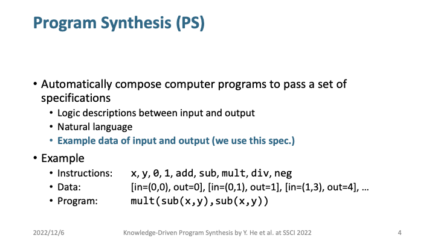

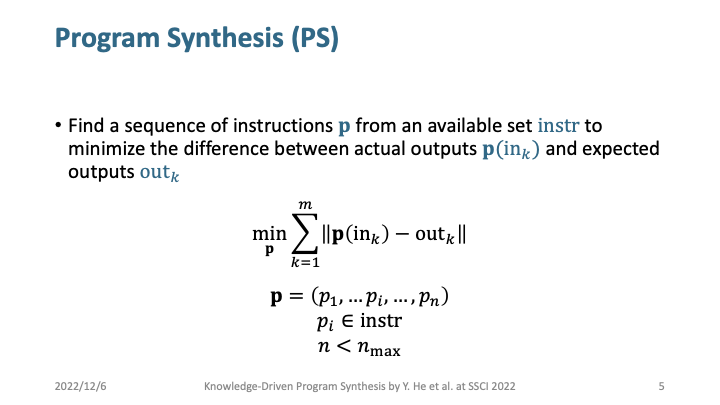


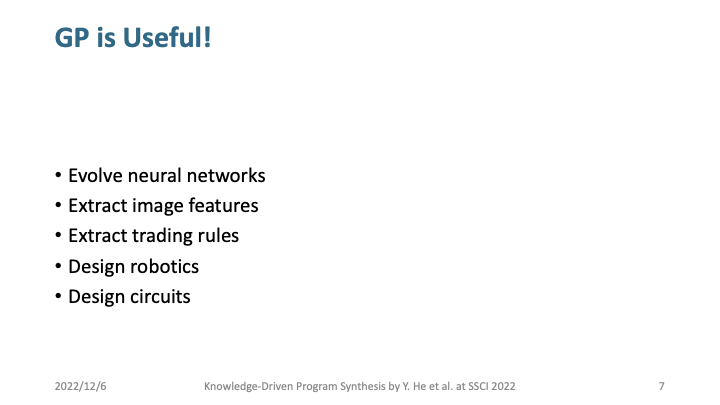


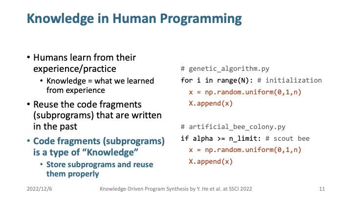


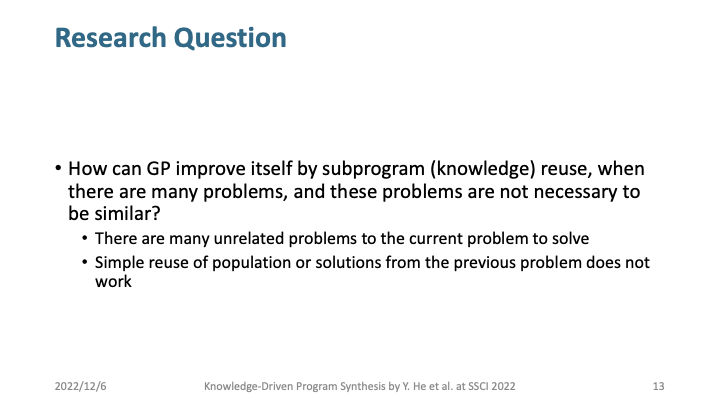

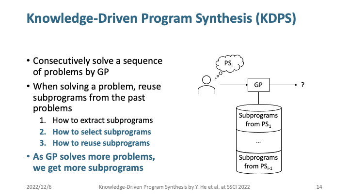


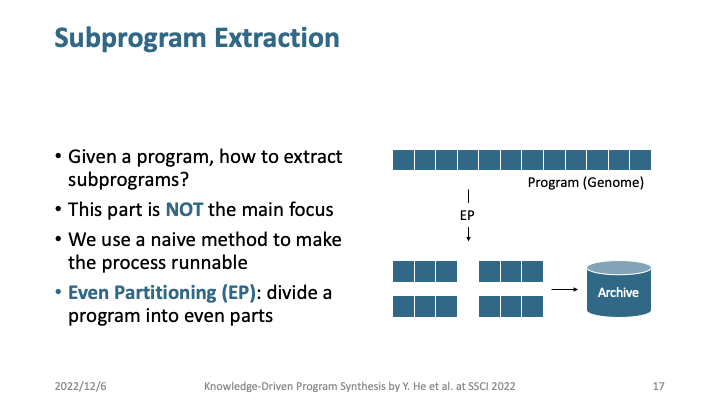

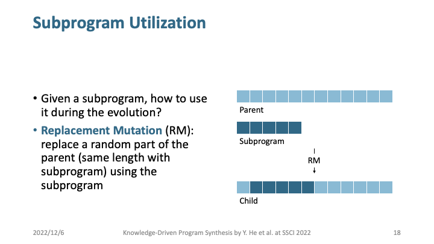

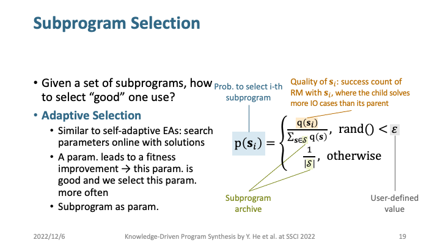


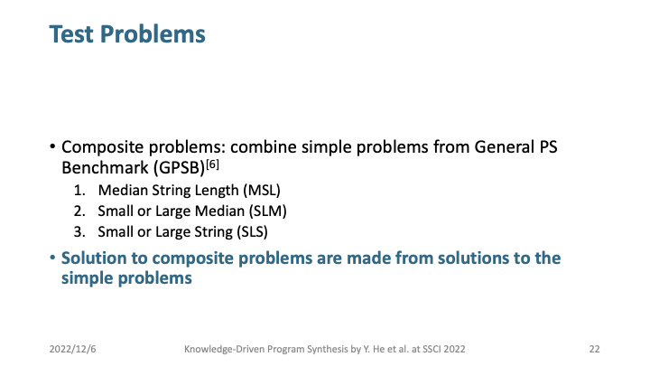

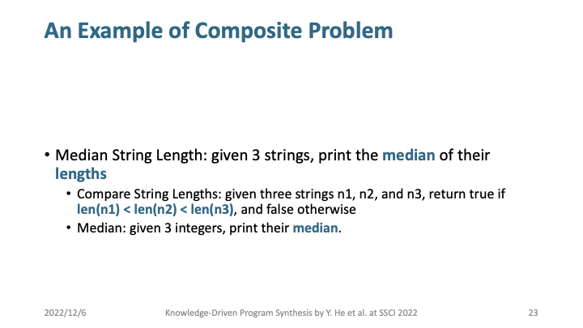

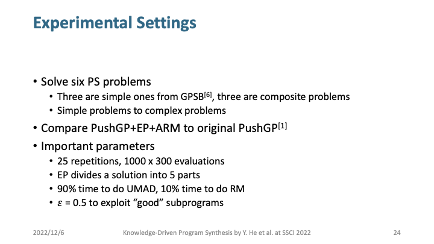

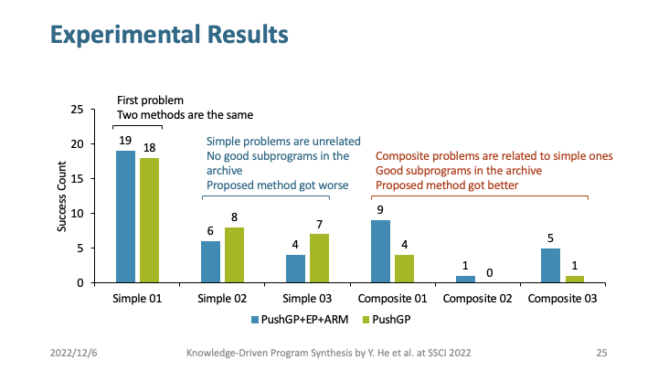

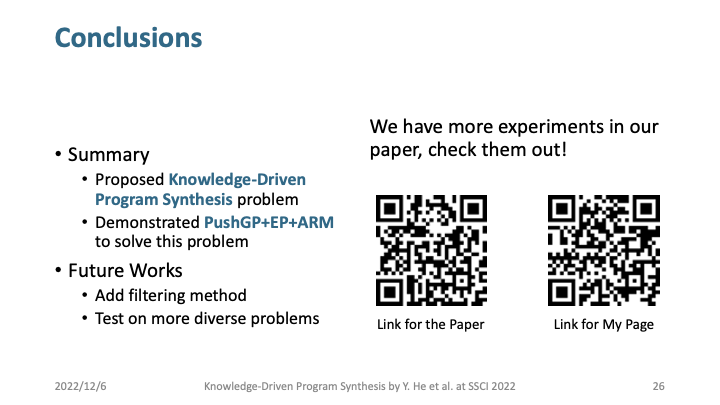


