# 遗传编程

[*>> Check this page in English*](/tutorials/gp/)

在这篇简短的文章中，我们将了解遗传编程，一组生成计算机程序的进化算法。

- [简介](#简介)
- [GP 的流程](#gp-的流程)
- [资源](#资源)
- [参考文献](#参考文献)

---

## 简介

*遗传编程*（GP：Genetic Programming）是一组合成计算机程序的进化算法（EA：Evolutionary Algorithm）。GP 以一组 $m$ 个示例 I/O 作为规范，并搜索满足给定示例的程序。这种自动编写计算机程序的任务称为*程序合成*（PS：Program Synthesis）。

通常，我们需要提供一组指令（原语）$\mathcal{I}$。GP 执行元启发式搜索来合成这些指令的序列 $\mathbf{p}$（程序），使得程序的输出与示例中给出的输出相同。

$$
\begin{aligned}
minimize &\quad \Sigma_{k=1}^m||\mathbf{p}(\mathrm{in}_k)-\mathrm{out}_k|| \\
s.t.     &\quad \mathbf{p}=(p_1,\dots,p_i,\dots,p_n) \\
         &\quad p_i\in\mathcal{I} \\
         &\quad n\leq n_{max}
\end{aligned}
$$

例如，我们有以下指令和 I/O 示例。

- 指令

  `x`、`y`、`add`、`sub`、`mult`、`div`

- I/O 示例

  | 输入  | 输出    |
  | ----- | ------ |
  | 1、2  | 1      |
  | 1、1  | 0      |
  | 5、-1 | 36     |

其中一个解可能是 `mult(sub(x,y),sub(x,y))`。这个程序等价于 ${(x-y)}^2$。

这个例子看起来很简单，但是 GP 也可以做很多很棒的应用。下面我列举一些 GP 的应用。它们都是一般 PS 问题的特例。

- 进化神经网络
- 设计软体机器人
- 设计电路
- 提取股票交易规则
- 提取图像特征

## GP 的流程

GP[^1] 的初始版本包含 EA 的典型步骤，即初始化、选择、交叉和变异。值得注意的是，GP 的初始版本使用树将计算机程序编码为基因组。GP 还采用膨胀控制（bloat control）技术来防止树的大小无限增大。

### 编码

计算机程序可以用树来表示。在树中，每个节点都将其子节点作为参数。叶节点是不带参数的终端，例如输入“x”和“y”。根节点返回程序的计算结果。下图显示了程序 `mult(sub(x,y),sub(x,y))` 的树。

通常，GP 从这种类型的树（程序）的随机种群开始。GP 在种群中选择更好的树并更新它们以连续获得新的树。

### 初始化

在初始化步骤中，随机生成了深度在指定区间的 $N$ 个树。生成树的一种方法是从随机根节点开始，然后使用随机原语递归添加子节点，直到所有节点都有足够的子节点。

### 选择

GP 的选择步骤与遗传算法（GA：Genetic Algorithm）相同。例如，我们可以使用锦标赛选择（TS：Tournament Selection）。TS 从种群中随机选择一个子集（大小为 $t$），并将该子集中最好的个体作为选定的亲代个体。

### 交叉

GP 的交叉是专门为树数据结构设计的。在交叉过程中，两个亲代个体将交换它们的子树以生成两个子代个体。这些子树是随机选择的。

### 变异

与交叉类似，GP 的变异也是针对树数据结构设计的。变异步骤用随机生成的树替换亲代个体中随机选择的子树。

### 膨胀控制

显然，树的大小在进化过程中并不是固定的。例如，如果变异算子将一个叶节点替换为一棵树（深度为3），则子代个体的大小会变大。没有任何限制，树的大小可以在进化过程中不断增加。这个问题称为膨胀（bloat）。

膨胀会导致至少三个问题。

1. 体积大的树需要更多时间来评估适应度。
2. 体积大的树表示搜索空间大。
3. 体积大的树中深层节点的变异很难传播到根节点。

为了控制这个膨胀问题，一个简单的方法是如果子代个体超过预设深度，则放弃子代个体并恢复到其亲代个体。

## 资源

以下是实现简单 GP 算法的一些资源。

- [通过 DEAP 库使用 GP 进行符号回归的 Python 示例](https://github.com/DEAP/deap/blob/master/examples/gp/symbreg.py)
- [另一个 GP 的 Python 库 - gplearn](https://github.com/trevorstephens/gplearn)

## 参考文献

[^1]: Koza, John R. "Genetic programming as a means for programming computers by natural selection." *Statistics and computing* 4.2 (1994): 87-112.
