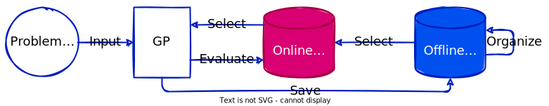

# Knowledge-Driven Program Synthesis

> Can programs write programs?

## Program Synthesis

Computer programs are convenient tools that bring us the power of automation.
However, creating computer programs is a non-trivial task and usually requires a
large amount of human resources.

**Program Synthesis (PS)** aims to build an intelligent agent that composes
computer programs with minimal human efforts. In other words, PS refers to write
computer programs by a computer program.

### Example-based Program Synthesis

Program is a sequence of valid instructions that solves a specific task. For
instance, given a set of instructions {$x_1$, $x_2$, $+$, $-$, $\times$, $/$,
$0$, $1$} and the goal is to find a sequence so that it can pass the following
I/O pairs.

- $inputs=(x_1,x_2)=(0,0);\quad output=-1$
- $inputs=(x_1,x_2)=(0,1);\quad output=0$
- $inputs=(x_1,x_2)=(1,0);\quad output=-2$
- $inputs=(x_1,x_2)=(1,1);\quad output=0$
- $inputs=(x_1,x_2)=(2,2);\quad output=3$
- ...

One of the "correct" program that satisfies the above five I/O pairs is
$p(x_1,x_2)=(x_1+1)\times (x_2-1)$. In this example, the task is defined by a
set of I/O pairs. This type of PS problems is calle Example-based PS.

An Example-based PS can be defined as follows. $P_{instr}$ refers to all
possible sequences generated by instruction set $instr$. $S$ includes $N$ pairs
of I/O. $p(I_i)$ is the actual output of program $p$ with $i$-th input $I_i$.

$$
\begin{cases}
    minimize & \quad \Sigma_{i=1}^{N} ||p(I_i)-O_i|| \\
    s.t.     & \quad p\in P_{instr} \\
             & \quad S=\{(I_i,O_i)\}_{i=1\dots N}
\end{cases}
$$

&uparrow;<a href="#top">back to top</a>

---

## Genetic Programming

**Genetic Programming (GP)** is an evolutionary algorithm that solves PS. In the
original GP by Koza, a program is encoded as a tree. In this tree, a operator
node takes its child nodes as arguments and output its computational result to
its parent. The output of the entire program is the output of the root. The leaf
nodes do not take any arguments. They are usually constants or inputs of the
program.

For example, the program in the above section could be represented as follows.

The original GP utilizes random initialization, tournament selection, one-point
crossover, and uniform mutation. The one-point crossover exchanges subtrees from
two parent programs. The uniform mutation replaces the subtree of a parent with
a random subtree.

Despite the original tree-based GP, there are many GP variants.

- Linear GP
- Cartesian GP
- Graph GP
- PushGP
- Grammar Evolution
- ...

&uparrow;<a href="#top">back to top</a>

---

## Research Objectives

*To be done ...*

&uparrow;<a href="#top">back to top</a>

---

## Overview of the Conceptual System

*To be done ...*

&uparrow;<a href="#top">back to top</a>

---

## Detailed Design

*To be done ...*

&uparrow;<a href="#top">back to top</a>

---

[Home](/)/[Knowledge-Driven Program Synthesis](/kdps/)