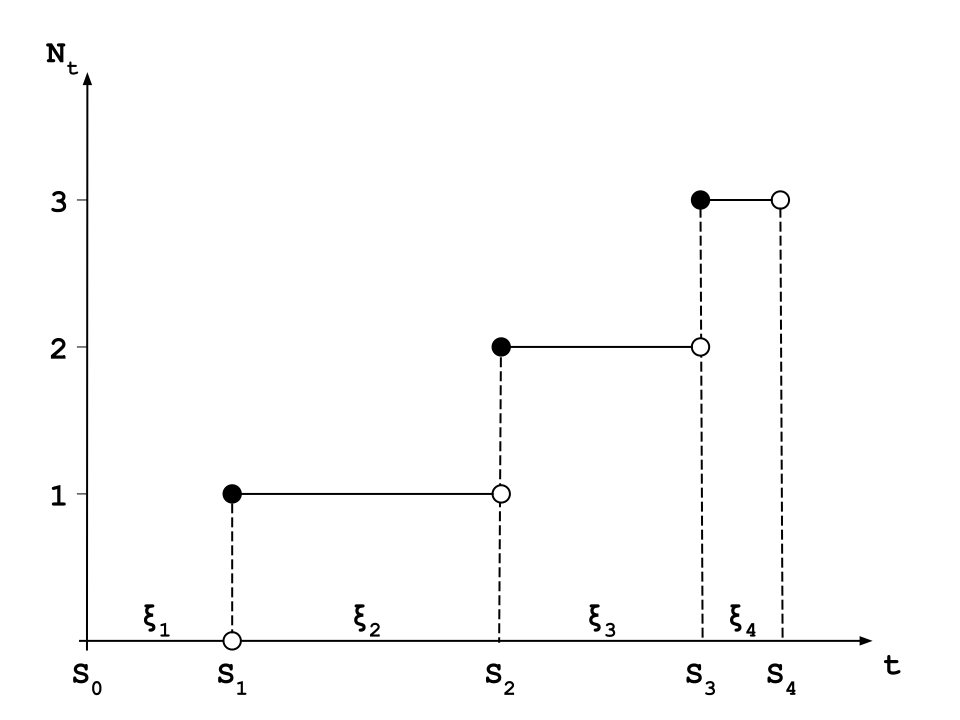

# Stochastic Process - Week 1.2 Renewal Process

- [Stochastic Process - Week 1.2 Renewal Process](#stochastic-process---week-12-renewal-process)
  - [Renewal Process](#renewal-process)
  - [Convolution](#convolution)
  - [Laplace Transform](#laplace-transform)
  - [Expectation of Counting Process](#expectation-of-counting-process)

## Renewal Process

- **Definition**

$$S_0=0,S_n=S_{n-1}+\xi_n$$

$$\xi_1,\xi_2,\cdots,\xi_n\text{ - i.i.d.} > 0$$

$$\mathbb{P}\left\{\xi_1 > 0\right\}=1\Rightarrow F(0)=0$$

$$N_t=\max_k\left\{S_k\leq t\right\}$$

- **Renewal times:** \\(S_0, S_1, \cdots\\)
- **Interarrival times:** \\(\xi_1, \xi_2, \cdots\\)
- **Properties:**
  - \\(S_n=\xi_1+\xi_2+\cdots+\xi_n\\)
  - \\( \left\\{S_n > t\right\\}=\left\\{N_t < n\right\\} \\)

## Convolution

- **Definition**

$$\text{Assume }X\perp\!\!\!\!\perp Y,$$

$$\forall X\sim F_X,\ Y\sim F_Y: \\F_X \star F_Y=F_{X+Y}(x)=\int_{\mathbb{R}}F_X(x-y)dF_Y(y)$$

$$\forall X\sim P_X,\ Y\sim P_Y: \\P_X \circ P_Y=P_{X+Y}(x)=\int_{\mathbb{R}}P_X(x-y)P_Y(y)dy$$

- **E.g.**

$$X\sim\exp(\lambda),\ Y\sim\exp(\mu)$$

$$P_{X+Y} = ?$$

- **Solution**

$$\forall x>0: P_X(x)=\lambda e^{-\lambda x},\ P_Y(x)=\mu e^{-\mu x}$$

$$
P_{X+Y}(x)=\int_{\mathbb{R}}P_X(x-y)P_Y(y)dy \\
=\begin{cases}
\int_{\mathbb{R}}\lambda e^{-\lambda(x-y)} \mu e^{-\lambda y}dy, & x>y>0 \\
0, & \text{otherwise}
\end{cases} \\
= \lambda\mu e^{-\lambda x} \int_0^x e^{(\lambda-\mu)y}dy = \lambda\mu e^{-\lambda x}\cdot\frac{1}{\lambda-\mu} \cdot e^{(\lambda-\mu)y} \Big\vert_0^x \\
=\frac{\lambda\mu}{\lambda-\mu}(e^{-\mu x} - e^{-\lambda x})
$$

- **Properties of convolution**
  1. \\(F^{n\star}(x) \leq F^n(x),\\) if \\(F(0)=0\\) and \\(\xi_1,\cdots\xi_n\text{ - i.i.d. }\sim F\\)
  2. \\(F^{n\star} \geq F^{(n+1)\star},\\) if \\(F(0)=0\\) and \\(\xi_1,\cdots\xi_n\text{ - i.i.d. }\sim F\\)
- **Theorems for a renewal process**
  1. \\(U(t)=\sum_{n=1}^\infty F^{n\star}(t)<\infty\\)
  2. \\(\mathbb{E}\left\\{N_t\right\\}=U(t)\\)

## Laplace Transform

- **Definition**

$$f:\mathbb{R}_+\rightarrow\mathbb{R},\ \mathcal{L}_f(s)=\int_{\mathbb{R}_+}e^{-sx}f(x)dx$$

- **Properties of Laplace Transform**
  1. \\(f\\) - density function and \\(\xi_1,\xi_2,\cdots\sim f\\), then \\(\mathcal{L}_f(s)=\mathbb{E}\\{e^{-s\xi}\\}\\)
  2. \\(f_1,f_2\\) - density function, then 
   $$\mathcal{L}_{f_1\circ{f_2}}(s) = \mathcal{L}_{f_1}(s)\cdot\mathcal{L}_{f_2}(s)$$
  3. \\(F\\) - distribution function, \\(F(0)=0\\), and \\(P=dF\\), then

$$\mathcal{L}_F(s)=\frac{\mathcal{L}_p(s)}{s}$$

$$
l.h.s=\mathcal{L}_F(s)=\int_{\mathbb{R}_+}F(x)e^{-sx}dx=
-\frac{1}{s}\int_{\mathbb{R}_+}F(x)d(e^{-sx}) \\
=-\frac{1}{s}\left[F(x)e^{-sx}\Big\vert_0^\infty-\int_{\mathbb{R}_+}e^{-sx}dF(x)\right]
=-\frac{1}{s}\left[0-\int_{\mathbb{R}_+}e^{-sx}P(x)dx\right] \\
=\frac{1}{s}\cdot\mathcal{L}_P(s)=r.h.s
$$

- **E.g.**

  - \\(\mathcal{L}_{x^n}(s)=?\\)

  $$\mathcal{L}_{x^n}(s)=\frac{1}{s}\mathcal{L}_{nx^{n-1}}(s)=\frac{n}{s}\mathcal{L}_{x^{n-1}}(s)=\frac{n(n-1)}{s^2}\mathcal{L}_{x^{n-2}}(s) \\=\cdots=\frac{n!}{s^n}\mathcal{L}_{x^0}(s)=\frac{n!}{s^n}\int_{\mathbb{R}_+}e^{-sx}dx=\frac{n!}{s^n}\cdot-\frac{1}{s}\left(e^{-sx}\Big\vert_0^\infty\right) \\=\frac{n!}{s^{n+1}}\cdot-\frac{1}{s}(0-1)=\frac{n!}{s^{n+1}}$$

  - \\(\mathcal{L}_{e^{ax}}(s)=?\\)

  $$\mathcal{L}_{e^{ax}}(s)=\int_{\mathbb{R}_+}e^{ax}e^{-sx}dx=\int_{\mathbb{R}_+}e^{(a-s)x}dx \\=\frac{1}{a-s}e^{(a-s)x}\Big\vert_0^\infty=\frac{1}{a-s}(0-1) \\=\frac{1}{s-a},\ (\text{if } s>a)$$

## Expectation of Counting Process

- \\(F\rightarrow\mathbb{E}\\{N_t\\}\\)

$$\mathbb{E}\{N_t\}=U(t)=\sum_{n=1}^\infty F^{n\star}(t)
=F(t)+\left(\sum_{n=1}^\infty F^{n\star}(t)\right)\star F(t)$$

$$U=F+U\star F=\int_{\mathbb{R}_+}U(x-y)dF(y)= \\
\int_{\mathbb{R}_+}U(x-y)P(y)dy=F+U\circ P$$

$$\mathcal{L}_U(s)=\mathcal{L}_F(s)+\mathcal{L}_U(s)\cdot\mathcal{L}_P(s) \\
=\frac{\mathcal{L}_P(s)}{s}+\mathcal{L}_U(s)\cdot\mathcal{L}_P(s)$$

$$\Rightarrow\mathcal{L}_U(s)=\frac{\mathcal{L}_P(s)}{s[1-\mathcal{L}_P(s)]}$$

- **Steps to solve the expectation of counting process**
  1. \\(F\rightarrow\mathcal{L}_P\\)
  2. \\(\mathcal{L}_P\rightarrow\mathcal{L}_U\\)
  3. \\(\mathcal{L}_U\rightarrow U\\)

- **E.g.**

$$S_n=S_{n-1}+\xi_n$$

$$\xi_1,\xi_2,\cdots\text{ - i.i.d }\sim P(x)=\frac{e^{-x}}{2}+e^{-2x},\ x>0$$

$$\mathbb{E}\{N_t\}=?$$

- **Solution**
  1. \\(F\rightarrow\mathcal{L}_P\\)

  $$
  \mathcal{L}_P(s)=\frac{1}{2}\mathcal{L}_{e^{-x}}(s)+\mathcal{L}_{e^{-2x}}(s) \\
  =\frac{1}{2(s+1)}+\frac{1}{s+2}=\frac{3s+4}{2(s+1)(s+2)}
  $$

  2. \\(\mathcal{L}_P\rightarrow\mathcal{L}_U\\)

  $$
  \mathcal{L}_U(s)=\frac{\mathcal{L}_P(s)}{s[1-\mathcal{L}_P(s)]}=\frac{3s+4}{s^2(2s+3)}
  $$

  $$
  \text{Let }\mathcal{L}_U(s)=\frac{A}{s^2}+\frac{B}{s}+\frac{C}{2s+3}
  $$

  $$
  \Rightarrow A=\frac{4}{3},B=\frac{1}{9},C=-\frac{2}{9}
  $$

  $$
  \mathcal{L}_U(s)=\frac{4}{3}\cdot\frac{1}{s^2}+\frac{1}{9}\cdot\frac{1}{s}+\left(-\frac{2}{9}\right)\cdot\frac{1}{2s+3}
  $$

  3. \\(\mathcal{L}_U\rightarrow U\\)

  $$
  U(t)=\frac{4}{3}t+\frac{1}{9}-\frac{2}{9}e^{-\frac{3}{2}t}
  $$

---

[Home](/) > [Notes](/notes/) > [Stochastic Process](/notes/stochastic-process/) > [Week 1.2](/notes/stochastic-process/week-1.2/)