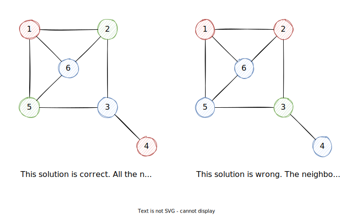
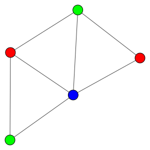

# Solving Graph Coloring Problems with Evolutionary Computation

## Graph Coloring Problem

Graph Coloring Problem (GCP) aims to find a solution that allocates colors to the nodes of a graph so that the neighbor nodes (i.e., nodes connected with an edge) have different colors.

k-GCP refers to GCP with k colors available. In this tutorial, we will look at 3-GCP where three colors (red, green, and blue) are available for the coloring. In the figure below, there are two solutions for a 3-GCP with 6 nodes and 8 edges.

- The solution on the left is correct since every pair of neighbor nodes have different colors.
- The solution on the right is wrong. There are two pairs of neighbor nodes sharing the same colors. Node 1 and Node 2 are neighbor but both colored with red; Node 5 and Node 6 are colored with blue.



## 3-GCP as an Optimization Problem

To find the solution of 3-GCP problem, we can convert it to an optimization problem. That is, to minimize the number of neighbor node pairs that share the same colors. We call this number "violation point". In the previous figure, the violation point of the left solution is 0 and the violation point of the right solution is 2.

**Notice that not every 3-GCP problem has a correct solution.** However, it is proved that 4-GCP must have a solution with violation point of 0 ([check Wikipedia](https://en.wikipedia.org/wiki/Four_color_theorem)).

We can use a adjacent matrix to represent the graph and use a vector to represent the coloring solution.

For example, the graph in the previous figure can be represented as the following matrix $\mathcal{A}$. The element $a_{ij}$ indicates whether there is an edge between Node $i$ and Node $j$ (1 for yes, 0 for no).

$$
\mathcal{A}=
\begin{bmatrix}
    0 & 1 & 0 & 0 & 1 & 1 \\
    1 & 0 & 1 & 0 & 0 & 1 \\
    0 & 1 & 0 & 1 & 1 & 0 \\
    0 & 0 & 1 & 0 & 0 & 0 \\
    1 & 0 & 1 & 0 & 0 & 1 \\
    1 & 1 & 0 & 0 & 1 & 0
\end{bmatrix}
$$

The left coloring solution in the previous figure can be represented as the vector $\mathbf{x}$ where 0, 1, and 2 represent red, green, and blue, respectively.

$$
\mathbf{x}=(0,1,2,0,1,2)
$$

Therefore, 3-GCP can be formulated as follows.

$$
\begin{aligned}
    minimize &\quad f(\mathbf{x})=\Sigma_{ij}\ a_{ij}\mathbb{I}(x_i,x_j) \\
    s.t      &\quad \mathbf{x}=(x_1,\dots,x_n) \\
             &\quad x_i\in\{0,1,2,\} \\
             &\quad \mathcal{A}=\begin{bmatrix}
                                    a_{11} & \cdots & a_{1n} \\
                                    \vdots & \ddots & \vdots \\
                                    a_{n1} & \cdots & a_{nn}
                                \end{bmatrix} \\
             &\quad \mathbb{I}(x_i,x_j)=\begin{cases}
                                            1, & x_i=x_j \\
                                            0, & x_i\neq x_j
                                        \end{cases}
\end{aligned}
$$

The Python code of the objective function is provided as follows.

```python
import numpy as np

def violation_point(x, A):
    I = x[:,None]==x
    return np.sum(I*A)//2

# example in the previous graph (solution on the right)
A = np.array([[0,1,0,0,1,1],
              [1,0,1,0,0,1],
              [0,1,0,1,1,0],
              [0,0,1,0,0,0],
              [1,0,1,0,0,1],
              [1,1,0,0,1,0]])
x = np.array([0,0,1,2,2,2])
print(violation_point(x, A))
# 2
```

## Creating 3-GCP Benchmark with Randomly Generated Graphs

To create a benchmark of 3-GCP, we usually need a way to generate many different graphs, however, with two specifications.

1. There is a correct solution (i.e., the optimal objective value is 0.) for the generated 3-GCP.
2. The graph is connected ([check Wikipedia](https://en.wikipedia.org/wiki/Connectivity_(graph_theory))).

The basic idea is to generate a random graph that has a correct solution. Then, check whether it is connected or not. If not, regenerate the graph.

### Creating 3-GCP with a Correct Solution

To satisfy the first specification, a simple way is to divide the nodes into three sets. The nodes in the same set should assign no edge between them.

For example, we have five nodes {1,2,3,4,5}. We can divide them into three sets: {1,2}, {3,4}, {5}. As long as there is no edge between nodes in the same set, we can find a correct solution. That is, to assign the nodes in the each set with one color. In this example, we can assign "red" to 1 and 2; "green" to 3 and 4; "blue" to 5.

An easy way to separate nodes into three sets is using modulo operation. The node with same remainder by 3 belongs to the same set.

```python
def random_graph(n_node, n_edge):
    # adjacent matrix (no edge assigned)
    A = np.zeros((n_node, n_node), dtype=int)
    # loop when number of edges is less than n_edge
    while np.sum(A)//2 < n_edge:
        # select two random nodes i and j
        i, j = np.random.randint(n_node, size=2)
        # assign edge between i and j if they are not in the same
        # set and there is no edge assigned between them yet
        if (i-j)%3!=0 and A[i][j]==0:
            A[i][j] = A[j][i] = 1
    return A

np.random.seed(318)
print(random_graph(5, 7))
# [[0 0 1 0 1]
#  [0 0 1 1 0]
#  [1 1 0 1 1]
#  [0 1 1 0 1]
#  [1 0 1 1 0]]
```

### Checking the Connectivity of the Graph

There are many methods to check the connectivity of a graph ([check this article](https://www.noveltech.dev/fully-connected-graph/)).

Here I am using the third way in the article, the Laplacian matrix method. You can implement other methods, such as DFS or using Networkx, as well.

```python
def is_connected(A):
    # degree matrix
    D = np.diag(np.sum(A, axis=1))
    # eigenvalues of laplacian matrix
    w, _ = np.linalg.eig(D-A)
    return sorted(w)[1] > 0

print(is_connected(A))
# True
```

Now, we can combine the code above to generate a random connected graph with a correct coloring solution.

```python
def random_connected_graph(n_node, n_edge):
    is_A_connected = False
    while not is_A_connected:
        A = random_graph(n_node, n_edge)
        is_A_connected = is_connected(A)
    return A
```

### Visualization of the Graph

To plot the graph, there are several libraries such as Networkx and igraph. Here I use igraph. You can install it with the following command.

```bash
pip install igraph pycairo
```

```python
from igraph import Graph, plot

def plot_graph(A, x=None, target=None, colors = ["red","green","blue"], bbox=(300, 300)):
    # create graph by adjacency matrix
    g = Graph.Adjacency(A, mode="undirected")
    # assign gray as default color of the nodes
    g.vs["color"] = "gray"
    # assign colors in the solution if it is provided
    if isinstance(x, np.ndarray):
        color = [colors[i] for i in x]
        g.vs["color"] = color
    # plot the graph
    # target: None for direct plotting, filename for saving plot
    # bbox: size of the graph
    plot(g, layout=g.layout("kk"), target=target, bbox=bbox)

x = np.array([0,1,2,0,1])
plot_graph(A, x)
```



## Genetic Algorithm

Genetic Algorithm (GA) is the most well-known Evolutionary Computation method. It mimics the biological evolutionary process and contains the following steps.

1. Initialize a population randomly
2. Compute fitness values of individuals
3. Save elite individuals
4. Select parents with high fitness values
5. Crossover
6. Mutation
7. Go to Step 2

### Initialization

GA usually starts with a random population of solutions. With numpy, it is very easy to implement.

```python
import numpy as np

def initialize(n_pop, n_node):
    X = []
    for _ in range(n_pop):
        # add a random solution for the graph with n nodes
        X.append(np.random.randint(3, size=n_node))
    return X

np.random.seed(318)
X = initialize(5, 9)
print(X)
# [array([2, 2, 0, 2, 1, 1, 0, 2, 1]),
#  array([2, 2, 0, 0, 0, 1, 1, 2, 0]),
#  array([1, 1, 2, 2, 1, 1, 2, 0, 2]),
#  array([0, 0, 2, 2, 2, 2, 1, 0, 2]),
#  array([2, 2, 1, 2, 0, 0, 2, 0, 0])]
```

### Fitness Computation

Fitness value (i.e., how much does a solution fit to the problem) is a number to describe the quality of the solution. The higher fitness value indicates the better quality.

3-GCP is a minimization problem where a small objective value shows a better quality. Therefore, we need to transform the objective to the fitness value. Obviously, the maximum value of the violation point is the number of edges $N_{edge}$. Therefore, I use the following transformation.

$$
f'(\mathbf{x})=1-\frac{f(\mathbf{x})}{N_{edge}}
$$

```python
from gcp import violation_point, random_connected_graph

def fitness(x, A):
    f = violation_point(x, A)
    n = np.sum(A)//2 # number of edges
    return 1 - f/n

def fitness_computation(X, A):
    return [fitness(x, A) for x in X]

A = random_connected_graph(9, 15)
F = fitness_computation(X, A)
print(F)
# [0.6, 0.7333333333333334, 0.4666666666666667, 0.6666666666666667,
#  0.6666666666666667]
```

### Elite Preservation

Elite means the solutions that hold the best fitness values. We do not want to lose them when we do the later crossover or mutation. Therefore, we directly save them to the population to the next iteration.

```python
def elite_preservation(X, F, n_elite):
    E = []
    # sort id of the individuals based on fitness values
    # take the first n_elite ids
    elite_id = sorted(range(len(F)), key=lambda k: F[k], reverse=True)[:n_elite]
    for i in elite_id:
        E.append(X[i])
    return E

E = elite_preservation(X, F, 1)
print(E)
# [array([2, 2, 0, 0, 0, 1, 1, 2, 0])]
```

### Parent Selection

```python
def parent_selection(X, F, n_parent):
    X_ = []
    p = [f/sum(F) for f in F]
    ids = np.random.choice(len(X), size=n_parent, p=p)
    for i in ids:
        X_.append(X[i])
    return X_

X_ = parent_selection(X, F, 2)
print(X_)
# [array([2, 2, 0, 2, 1, 1, 0, 2, 1]),
#  array([1, 1, 2, 2, 1, 1, 2, 0, 2])]
```


---

[Home](/) > [Tutorials](/tutorials/) > [Solving Graph Coloring Problems with Evolutionary Computation](/tutorials/gcp/)
