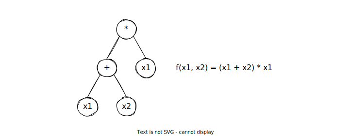

# Solving Program Synthesis Problems with PushGP

- [Program Synthesis](#program-synthesis)
- [PushGP](#pushgp)
- [General Program Synthesis Benchmark Suite](#general-program-synthesis-benchmark-suite)

## Program Synthesis

Program Synthesis (PS), or the automatic programming, is an interesting, important, and challenging area of research. PS requires an agent that composes computer programs without the help of humans and satisfies a set of specifications. Here, I list some examples of the specifications.

1. **Logics between inputs and outputs**

   The following equations shows a set of logics between inputs and outputs of the maximum function (i.e., return the maximum value in the two given real numbers).

   $$
   \begin{align}
   find  &\quad f:\mathbb{R}^2\rightarrow\mathbb{R}\\
   s.t.  &\quad f(x,y)\geq x\operatorname{and}f(x,y)\geq y \\
         &\quad f(x,y)=x\operatorname{or}f(x,y)=y
   \end{align}
   $$

2. **Natural language description**

   The natural language description of the previous function could be "given two real numbers, return the maximum value".

3. **Input-Output examples**

   We can also use input-output pairs to specify the program to synthesis.

   $$
   \{[\operatorname{input},\operatorname{output}]\}=\{[(1,2),2], [(2,3),3],\dots\}
   $$

In this tutorial, we focus on the third way, using input-output examples. The algorithm to generate programs by examples is called PushGP.

---

## PushGP

PushGP[^1] is a variant of Genetic Programming, which is an Evolutionary Algorithm designed for PS tasks. That is to say, PushGP also contains the main steps of an Evolutionary Algorithm: initialization, selection, crossover, and mutation.

The figure above shows a tree representation of a computer program "$(x_1+x_2)\cdot x_1$". This tree representation is used in the original GP algorithm by Koza[^2]. In this tree, a parent node takes the outputs of its children as argument.

There are several limitations of the tree-based GP. For example, it is difficult to compose programs with loops and recursion using trees. Also, the tree structure does not support multiple outputs of a program. Moreover, things become complicated if one are going to design mutation or crossover operators consider multiple data types within a tree.

PushGP solves these problems very well. The genome of PushGP is a list of Push (i.e., a stack-based programming language) instructions.

---

## General Program Synthesis Benchmark Suite

[^1]: Helmuth, T., McPhee, N. F., & Spector, L. (2018, July). Program synthesis using uniform mutation by addition and deletion. In *Proceedings of the Genetic and Evolutionary Computation Conference* (pp. 1127-1134).
[^2]: Koza, J. R. (1994). Genetic programming as a means for programming computers by natural selection. *Statistics and computing*, 4(2), 87-112.
